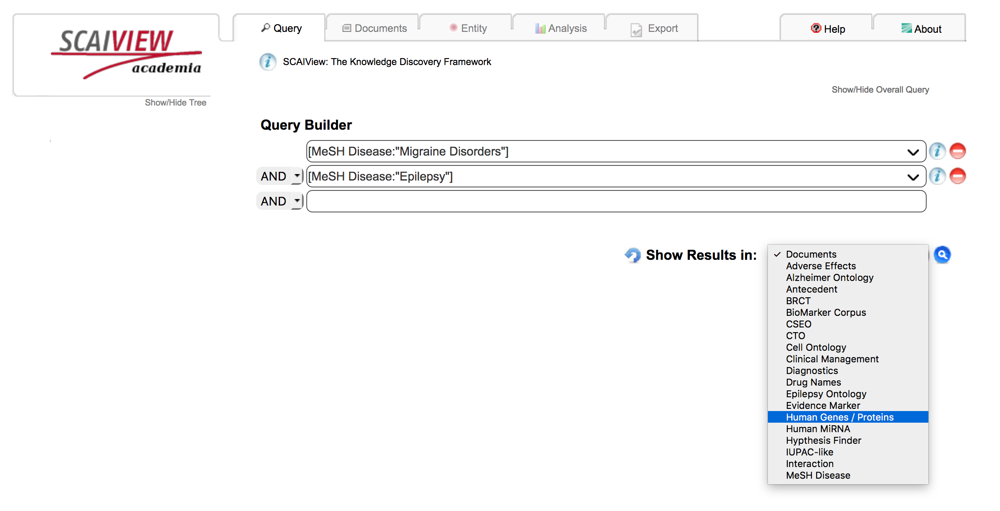
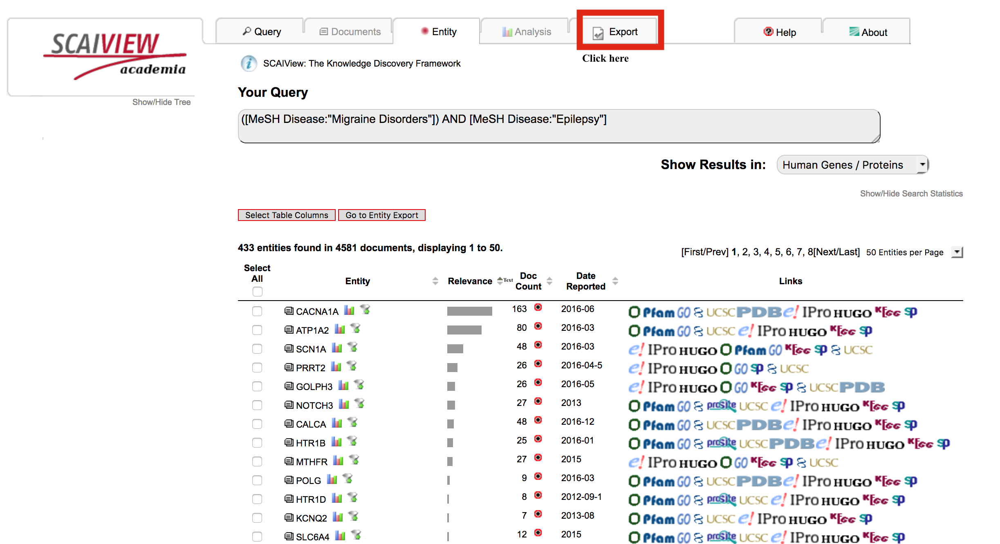
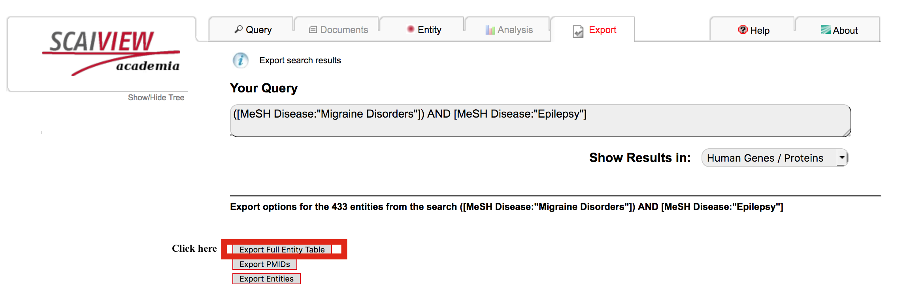

EpiCom - an Epilepsy comorbidity analysis using the overlapping genes in the literature
=======================================================================================

This repository contains code and resources used for the analysis described in Hoyt et al., 2018.

Structure of the project
------------------------

1. The resources folder contains all documents retrieved from SCAView queries as well as the tables and supplementary information presented in the paper

2. 'Epilepsy SCAIView comordbity analysis' is a Jupyter notebook outlining the calculations of pleitropy rates using the resources in the repository.

SCAIView queries
----------------

Following, the steps to follow in order to reproduce the data

